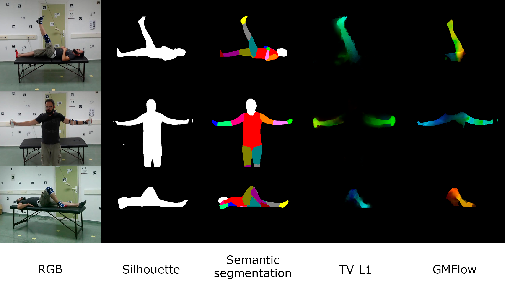

# UCOPhyRehab++
---

[  ](https://doi.org/10.5281/zenodo.17935737) [  ](https://doi.org/10.1038/s41597-026-07362-5)



This repository contains the code used to train and evaluate models for **3D angle prediction** on the **UCOPhyRehab++** dataset.  
The goal is to allow other researchers to **reproduce the experiments** reported in the paper, including:

- Training on **individual camera viewpoints** vs. **all viewpoints jointly**.
- Comparing different **visual modalities**:
  - Silhouettes  
  - Optical Flow (GMFlow, TV-L1)  
  - Semantic Segmentation  
  - (Optionally) RGB / other modalities
- Evaluating performance using **Mean Absolute Error (MAE)** in degrees with a **4-fold cross-validation** scheme.

This project uses [Hydra](https://hydra.cc/) as a baseline. The configuration files used in the paper are provided as an example. You can override every label from the default files in your `experiment` folder.

---

## 1. Repository structure


```
.
├── conf/                   # Configuration files
│   ├── data                
│   ├── experiment              # All the experiments are here
│   ├── loss
│   ├── model
|   ├── training
|   └── default.yaml            # Default config file
|
├── data/                    # Configuration files
│   ├── manifests               # Sets of data for train/val/test
|   └── splits                  # Split files
|
├── scripts
│   ├── build_manifest.sh
│   ├── train.sh
│   └── test.sh
|
├── src/
│   ├── cli/
│   ├── data/
│   ├── logging/
│   ├── loss/
│   ├── metric/
│   ├── model/
│   ├── normalization/
│   └── utils/
|
├── requirements.txt        # pip dependencies
└── README.md
```

## 2. Instalation
### 2.1. Clone the repository
```
git clone https://github.com/AVAuco/ucophyrehabpp.git
cd ucophyrehabpp
```
### 2.2. Create the environment
**OPTION A - Conda (recommended)**
```
conda env create -f requirements.yaml
conda activate ucophyrehab2
```
**OPTION B - pip**
```
python -m venv .ucophyrehab2
source .ucophyrehab2/bin/activate
pip install -r requirements.txt
```
## 3. Dataset preparation
### 3.1. Separate frames
First of all, you need to launch the `prepare_dataset` script to separate the frames from the distributed `.mp4` videos. You just need to launch the provided script specifying the downloaded and uncompressed dataset root, the modality that you want to separate and the output path.

```
bash scripts/prepare_dataset.sh /path_to_your_mp4_dataset_root <modality> /output_path
```

### 3.2. Build Manifests
Once that you have the frames separated for the desired modality, you will need to build a manifest for the data set of your experiment. Create a new configuration file or use one of the provided ones.

You must specify the path to the UCOPhyRehab++ dataset root, the modality you want to use and the extension of the target files. Also, if you want to change the splits of the data, you must specify the new files in `conf/data/ucophyrehab_base.yaml` or in your `experiment` file.

For example, we're going to prepare the data manifest for `Silhouettes`, exercise `01_05`, `cam0` and `split_1`. Then, we have to modify the file `conf/sils/split_1/ex_01_05_cam0.yaml` modifying the following fields:

```
data:
  modality: "sils"
  channels: "1"
  dataset_loader: "SilsFolderDataset"
  split_path: "data/splits/split_1_80_10_10.json"
  split_name: "split_1"
  include_exercises: ['01', '05']
  include_cameras: ['cam0']
```

This configuration will inherit the rest of the fields from the other files but will override the specified in the `data` section.

Once the configuration is finished, you must run the following script:
```
python -m src.cli.build_manifest experiment=sils/split_1/ex_01_05_cam0
```

You can automatize this process by writing all your configuration files and calling to the `build_manifest` function from a single script, like the examples in the `scripts` folder.

## 4. Running the experiments
### 4.1. Training
To train our example file:
```
python -m src.cli.train experiment=sils/split_1/ex_01_05_cam0
```
### 4.2. Test
Once it finishes, you can launch the test using the same configuration file:
```
python -m src.cli.test experiment=sils/split_1/ex_01_05_cam0
```

## 5. Logs and output
You can find the logs of your experiments in the `output` folder.

# Dataset download
You can download the dataset from Zenodo: 

# Citation
```
@article{AguilarOrtega2026,
  author    = {Aguilar-Ortega, Rafael and Zafra-Palma, Jorge and Mu{\~n}oz-Salinas, Rafael and Marin-Jimenez, Manuel J.},
  title     = {UCOPhyRehab++: A multi-modal and multi-view dataset for human rehabilitation analysis},
  journal   = {Scientific Data},
  year      = {2026},
  month     = {may},
  day       = {7},
  volume    = {},
  number    = {},
  pages     = {},
  issn      = {2052-4463},
  doi       = {10.1038/s41597-026-07362-5},
  url       = {https://doi.org/10.1038/s41597-026-07362-5},
  abstract  = {The rehabilitation of patients with musculoskeletal disorders is usually associated with the performance of prescribed exercises at home. Performing these exercises without medical supervision may lead to incorrect execution, resulting in secondary injuries or slower recovery rates for these patients. For this reason, research into assisted rehabilitation methodologies for patients of this type has been one of the most studied fields in recent years. The use of computer vision techniques has rapidly increased in recent literature. However, there is a significant lack of available data for training machine learning models or for testing these systems. In this paper, we extend our previous work, UCOPhyRehab (University of COrdoba Physical Rehabilitation), by adding multiple modalities to the original data, incorporating demographic metadata, and including performance scores assigned by an expert physical therapist. Our validation experiments demonstrate that this new release complements the original UCOPhyRehab data and enables new research directions, such as multi-modal fusion (e.g., combining silhouettes, optical flow, and semantic segmentation) and multi-view fusion across the five camera viewpoints, to improve the robustness and accuracy of rehabilitation-assistance methods.}
}
```
